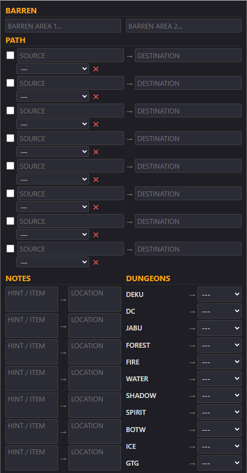

# OoT Rando Notes Tracker

A comprehensive web-based tracking tool designed specifically for **The Legend of Zelda: Ocarina of Time Randomizer** (OoT Rando). This application helps players manage hints, track paths, organize notes, and monitor dungeon entrances during randomizer gameplay.



## Overview

This tracker is built to assist players during Ocarina of Time randomizer runs by providing a centralized interface to:
- Record barren (empty) locations
- Track paths from source to destination with items obtained
- Manage extensive notes and hints
- Dynamically map dungeon entrances in entrance randomizer mode
- Automatically sync dungeon data from the RMG (Rosalie's Mupen GUI) auto-tracker

## Features

### 1. **Barren Locations Tracking**
- Two text areas to record areas confirmed as barren (containing no important items)
- Helps identify dead ends and optimize exploration strategy

### 2. **Path Tracking System**
- 8 individual path tracking entries with:
  - **Source Field**: Starting location of the path
  - **Destination Field**: End location of the path
  - **Item Dropdowns**: Dynamically add items obtained along the path
  - **Resolution Checkbox**: Mark a path as resolved once completed
- **Smart Dropdown System**:
  - All available items and songs from the game appear in dropdowns
  - Each item can only be selected once (prevents duplicate entries)
  - New dropdown rows automatically generate when you select an item (except for completed paths)
  - Delete button allows removal of the last item in each path
- Items automatically become unavailable in other dropdowns once selected

### 3. **Notes Section**
- 7 dedicated note entries with:
  - **Hint/Item Field**: Record the hint or item reference
  - **Location Field**: Note where the item/hint relates to
- Useful for tracking complex hint clues and their potential locations

### 4. **Dungeon Entrance Management**
- Dropdown menus for all 11 dungeon entrances (excluding Ganon's Castle):
  - Deku Tree (Deku), Dodongo's Cavern (DC), Jabu Jabu's Belly (Jabu), Forest Temple (Forest), Fire Temple (Fire), Water Temple (Water), Shadow Temple (Shadow), Spirit Temple (Spirit), Bottom of the Well (BotW), Ice Cavern (Ice), Gerudo Training Grounds (GTG)
- Each entrance can map to any other dungeon location
- Mutually exclusive selection (each destination can only be assigned once)

### 5. **Auto-Tracker Integration**
- **WebSocket Connection**: Automatically connects to the RMG auto-tracker server.
- **Real-time Dungeon Sync**: Dungeon entrances are automatically updated in real-time as the game data changes in the emulator memory.
- **Graceful Fallback**: If the auto-tracker is not available, the tracker still functions normally with manual entrance entry.

---

## 📥 Setup & Installation (Recommended)

The easiest way to use the tracker is via the standalone executable. No Python installation or manual setup is required!

1. **Download the App**: 
   - Navigate to the **[Releases](../../releases)** section of this GitHub repository.
   - Download the latest **`OOT-AutoTracker.exe`** file.
   - Place it anywhere on your PC (like your Desktop).

2. **Start your Game**:
   - Launch your **RMG Emulator** and start your OoT Randomizer ROM.
   - Load into your save file so you are actively standing in the game world. *(The memory scanner cannot read the data if you are on the title screen).*

3. **Run the Tracker**:
   - Double-click `OOT-AutoTracker.exe`.
   - A background terminal will open to scan the game memory, and your default web browser will automatically open the tracker interface!
   - Watch for the green connection message in the browser console: "🟢 Connected to RMG Auto-Tracker Server!"

## Browser Storage

All data manually entered in the tracker (Notes, Paths, Barren locations) is stored in your browser's local storage.
- ✅ Data persists across browser sessions
- ✅ Data remains private (stored locally, not sent anywhere)
- ✅ No account or login required
- ⚠️ Clearing browser cache/cookies will erase all data
- ⚠️ Data is device/browser specific (not synced across devices)

---

## 💻 Developer / Manual Setup (Build from Source)

If you prefer to run the raw Python scripts or modify the code yourself:

1. **Clone the repository**:
   ```bash
   git clone <repository-url>
   cd oot-rando-notes
   ```
2. **Install dependencies**:
   ```bash
   pip install -r requirements.txt
    ```
3. **Start the Auto-Tracker:**
Ensure RMG is running in-game, then run:
   ```bash
   python src/launcher.py
   ```

---

## Contributing
Feel free to fork this project and submit pull requests for improvements and bug fixes.

## License
This project is provided as-is for personal use with The Legend of Zelda: Ocarina of Time Randomizer community.
